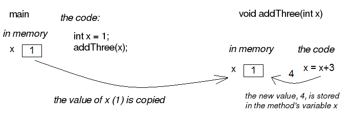
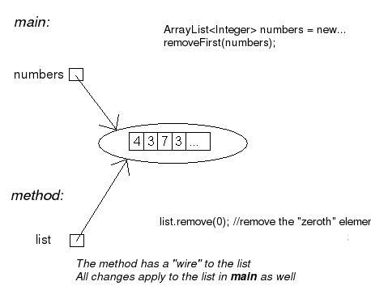

:doctitle: More about methods
:tabcolumns: d,h,d,d,h,d,d,d,d,d,d,d,d,d,d,d
include::../commonhead.adoc[]

[#_part1_3]
:source-language: java
:numbered!:

== MOOC Material Week 3

:numbered:
== Methods and visibility of variables

Let us try to change from within a method the value of a variable located in the main program.

[source,java]
----
// main program
public static void main(String[] args) {
    int number = 1;
    addThree();
}

// method
public static void addThree() {
    number = number + 3;
}
----

Unfortunately this program will not work, because the method cannot "see" the variable `number`
located in the main program.

This holds generally. Variables defined in the main program are not visible for other methods.
Also, the other way is similar: variables defined in methods are not visible for other methods or the main program. The only
way to give information to a method from the outside is to use parameters.

[source,java]
----
// main program
public static void main(String[] args) {
    int number = 1;
    System.out.println("Main program variable number holds the value: " + number);
    addThree(number);
    System.out.println("Main program variable number holds the value: " + number);
}

// method
public static void addThree(int number) {
    System.out.println("Method parameter number holds the value: " + number);
    number = number + 3;
    System.out.println("Method parameter number holds the value: " + number);
}
----

In the program above the method `addThree(int)` has a parameter called `number`.
This parameter is *copied* (duplicated) for the method to use. When the program above is executed we see the
following output:

[source]
----
Main program variable number holds the value: 1
Method parameter number holds the value: 1
Method parameter number holds the value: 4
Main program variable number holds the value:  1
----

The number we gave as a parameter to the method was *copied* for the method to use. If we
would like the main program to be able to use the new value generated by the method, the method needs to return that value.

=== Return values

A method can return a value. In the examples above, methods have not been returning anything. This is
expressed by writing *void* in the first line of the method, just before it's name.

[source,java]
----
public static void addThree() {
  ...
}
----

When defining a method that returns a value, we also have to define the type of the return value. We can
define the type of the return value by writing it just before the name of the method. Next, we have a method that always
returns the number 10 (type `int`). Returning a value is accomplished with the command return:

[source,java]
----
public static int alwaysReturnTen() {
    return 10;
}
----

If we want to use the returned value later, we have to catch the return value and store it into a variable:

[source,java]
----
public static void main(String[] args) {
    int number = alwaysReturnTen();

    System.out.println( "method returned the number " + number );
}
----

The return value of the method is assigned to a variable of type `int` just like any other integer.
The return value can also be a part of a sentence:

[source,java]
----
double number = 4 * alwaysReturnTen() + (alwaysReturnTen() / 2) - 8;

System.out.println( "calculation total " + number );
----

Every variable type we have seen this far can be used as a return value:

[source,java]
----
public static void methodThatReturnsNothing() {
  // method body
}

public static int methodThatReturnsInteger() {
  // method body, needs a return statement
}

public static String methodThatReturnsText() {
  // method body, needs a return statement
}

public static double methodThatReturnsFloatingpoint() {
  // method body, needs a return statement
}
----

If the method is defined to have a return value, it also has to return a value. The following method is
incorrect:

[source,java]
----
public static String wrongMethod() {
    System.out.println("I tell you that I will return a String but I do not!");
}
----

In the following example, we define a method for calculating a sum. Then, we use the method to
calculate 2 + 7. The return value (returned after the method call) is assigned to a variable called
`sumNumbers`.

[source,java]
----
public static int sum(int first, int second) {
    return first + second;
}
----

Method call:

[source,java]
----
int sumNumbers = sum(2, 7);
// sumNumbers now holds the value 9
----

Let us expand the example program so that the user types the numbers.

[source,java]
----
public static void main(String[] args) {
    Scanner reader = new Scanner(System.in);

    System.out.print("Type the first number: ");
    int first = Integer.parseInt( reader.nextLine() );

    System.out.print("Type the second number: ");
    int second = Integer.parseInt( reader.nextLine() );

    System.out.print("Total: " + sum(first,second) );
}

public static int sum(int first, int second) {
    return first + second;
}
----

As we can see, the return value of the method does not always need to be assigned to a variable. It can also
act as a part of the printing command just like any other integer value.

In the next example, we call the method sum using integers that we get as return values from the method
`sum`.

[source,java]
----
int first = 3;
int second = 2;

sum(sum(1, 2), sum(first, second));
// 1) the inner methods are executed:
//    sum(1, 2) = 3   and sum(first, second) = 5
// 2) the outer method is executed:
//    sum(3, 5) = 8
----

=== The method's own variables

The following method calculates the average of the numbers the method gets as parameters. The method
uses helper variables `sum` and `average`. The method's own variables can be
introduced just like any other variables.

[TIP]
====
The official name for the variables 'owned' by a method is *local* variable.
====

[source,java]
----
public static double average(int number1, int number2, int number3) {

    int sum = number1 + number2 + number3;
    double average = sum / 3.0;

    return average;
}
----

<!-- Screencast aiheesta: TODO   screencast -->
++++

<h3>Methods exercises</h3>
++++

include::{exercises}/ex43.adoc[]

include::{exercises}/ex44.adoc[]

include::{exercises}/ex45.adoc[]

include::{exercises}/ex46.adoc[]

++++

 <!-- ex group 43-46-->
++++

=== Strings of characters

In this section, we take a closer look at strings of characters in Java, which are called
`Strings`. We have already used variables of `String` type when printing, and learned
how to compare Strings. Comparing two strings is performed by *calling* the
`equals()` method of the string.

[source,java]
----
String animal = "Dog";

if( animal.equals("Dog") ) {
    System.out.println(animal + " says bow-wow");
} else if ( animal.equals("Cat") ) {
    System.out.println(cat + " says meow meow");
}
----

It is possible to ask the string how many characters long it is by writing `.length()` after
it's name. In other words, we are calling its length() method.

[source,java]
----
String banana = "banana";
String cucumber = "cucumber";
String together = banana + cucumber;

System.out.println("The length of banana is " + banana.length());
System.out.println("The length of  cucumber is " + cucumber.length());
System.out.println("The word " + together + " length is " + together.length());
----

In the above code, the method `length()` is called for three different strings. The call
`banana.length()` calls only the method that gives the length of the string `banana`,
while `cucumber.length()` calls the method that gives the length of the string
`cucumber` etc. The left part before the dot says whose method is called.

Java has a special data type, called `char`, to be used for characters. A `char`
variable can store only one character. A string variable can return a character from a specific location in itself with the method `charAt()` that uses the index of the location as a parameter. Note that counting the index of the character starts from zero!

[source,java]
----
String word = "Supercalifragilisticexpialidocious";

char character = word.charAt(3);
System.out.println("The 4th character of the word is " + character); //prints "e"
----

The characters in a string are numbered (indexed) starting from
0. This means that we can reach the last character in a string with number (or index) "the length
of the word minus one", or `word.charAt(word.length()-1)`. The following example will make
the program crash, because we are trying to get a character from an index that does not exist.

[source,java]
----
char character = word.charAt(word.length());
----

[TIP]
====
*A tip for using NetBeans*

* You can find all the NetBeans tips http://mooc.fi/courses/general/programming/#netbeans-tips"[here].
* *Renaming* +
    Variables, methods and classes (we will learn about these in the next set) need to have descriptive
    names. Often, a name is not that describing and needs to be changed. In NetBeans, it is really easy to rename things. Just select and "paint"
    the name you want to change with the mouse. Then press ctrl and r simultaneously, and write
    the new name.
====

++++

<h3>String exercises</h3>
++++

include::{exercises}/ex47.adoc[]

include::{exercises}/ex48.adoc[]

include::{exercises}/ex49.adoc[]

include::{exercises}/ex50.adoc[]

include::{exercises}/ex51.adoc[]

include::{exercises}/ex52.adoc[]

++++

 <!--string exgroup -->
++++
=== Other methods for strings

We often want to read only a specific part of a string. A method in the String class called
`substring` makes this possible. It can be used in two ways:

[source,java]
----
String word = "Supercalifragilisticexpialidocious";
System.out.println(word.substring(14)); //prints "listicexpialidocious"
System.out.println(word.substring(9,20)); //prints "fragilistic"
----

We can store the return value in a variable, because the return value of the `substring`
method is of type `String`.

[source,java]
----
String book = "Mary Poppins";
String endpart = book.substring(5);
System.out.println("Harry " + endpart); // prints "Harry Poppins"
----

Methods in the String class also make it possible to search for a specific word in text. For
example, the word "or" can be found in the word "Horse". A method called
`indexOf()` searches for the word given as a parameter in a string. If the word is found, it
returns the starting index (location), remember that the numbering starts from 0 of the word. If the
word is not found, the method returns the value -1.

[source,java]
----
String word = "aesthetically";

int index = word.indexOf("tic"); // index value will be 6
System.out.println(word.substring(index)); //prints "tically"

index = word.indexOf("ally"); //index value will be 9
System.out.println(word.substring(index)); //prints "ally"

index = word.indexOf("book"); // string "aesthetically" does not include "book"
System.out.println(index); //prints -1
System.out.println(word.substring(index)); //error!
----

//<!-- Screencast aiheesta: TODO   screencast -->

++++

<h3>The parts of a string.</3>
++++

include::{exercises}/ex53.adoc[]

include::{exercises}/ex54.adoc[]

include::{exercises}/ex55.adoc[]

include::{exercises}/ex56.adoc[]

++++

<!-- exgroup strings -->
++++

== Object

Strings and integers have some differences. Integers (int) are "just values", they can
be used in calculations and they can be printed on the screen:

[TIP]
====
int, double, long, and boolean are (amonst a few others), _primitive_ types as opposed to Object. +
There are Object variants for these numbers too, and, as all object types in Java, start with a capital Character. +
int vs Integer, double vs Double, long vs Long.
====

[source,java]
----
int x = 1;
int y = 2;

y = 3*x;

System.out.println( "value of y now: " + y );
----

Strings are a bit "cleverer" and for example know how long they are:

[source,java]
----
String word1 = "Programming";
String word2 = "Java";

System.out.println( "String "+ word1 +" length: " + word1.length() );

System.out.println( "String "+ word2 +" length: " + word2.length() );

----

Program output:

[source]
----
String Programming length: 11
String Java length: 4
----

We can determine the length by calling the String method `length()`. Strings have other
methods as well. Integers (or whole numbers, variables of type `int`) have no methods at all.
They do not "know" anything.

Strings are *objects*, or "something that has methods and a value". Later we will see
many other objects as well.

As we can see in the previous example, an object's methods are called by adding a dot and a method
call after the name of the object:

[source,java]
----
word1.length()    // String object's name is word1 and its method length() is called
word2.length()    // String object's name is word2 and its method length() is called
----

The method call is made explicitly to the object. In the above example, we have two objects and first we
call the `length()` method of the String object `word1` and then do the same for the
object `word2`.

Our old friend `reader` is also an object:

[source,java]
----
Scanner reader = new Scanner(System.in);
----

Even though readers and strings are both objects, they are not very similar. For example, readers (Scanners) have the `
nextLine()` method, but Strings do not. In the Java programming language, objects must be
"born", in other words created with the `new` command. Strings are objects that make
an exception to this rule! -- There are two ways to create a String object:

[source,java]
----
String banana = new String("Banana");
String carrot = "carrot";
----

Both of the commands above create a new String object. Using the `new` command when creating a
String objects is uncommon.

The object's "type" is called a *class*. The class of a string of characters is called
`String` and the class of readers is called `Scanner`. Later we learn much more about
classes and objects.

=== ArrayList or an "object container"

Often during programming, we would like to keep many different strings in memory. A very bad idea would be to define a variable for each of them: :

[source,java]
----
String word1;
String word2;
String word3;
// ...
String word10;
----

This would be such a good-for-nothing solution that it does not almost need an explanation -- think
of this approach for a word count of 100 or 1000!

Just like other modern programming languages, Java gives us different tools to store many objects neatly
in our programs. Now, we take a closer look at *ArrayList*, which is probably the most used object
container in Java.

The following lines of code make use of an ArrayList that holds specifically objects of type String.
A couple of strings are stored into the list.

[source,java]
----
import java.util.ArrayList;

public class ListProgram {

    public static void main(String[] args) {
        ArrayList<String> wordList = new ArrayList<String>();

        wordList.add("First");
        wordList.add("Second");
    }
}
----

In the above main program method, the first row creates a new ArrayList called `wordList`, which
can be used as a container for String variables. The type of the ArrayList is
`ArrayList<String>`, which means that the ArrayList is meant for storing Strings. The
list is created using the command `new ArrayList<String>();`.

<b>Note:</b> to make the ArrayList work, we must first write an import statement at the beginning of the program  either `import java.util.ArrayList;` or `import
  java.util.*;`

When the list is created, two strings are added by calling the list method `add`. The list
will not run out of space, so theoretically the list can contain any amount of Strings (as long as they fit
in the computer's memory).

Internally an ArrayList is -- as its name suggests -- a list. The added strings automatically go to the
end of the ArrayList.

==== Methods of ArrayList

ArrayList provides us with many useful methods:

[source,java]
----
public static void main(String[] args) {
    ArrayList<String> teachers = new ArrayList<String>();

    teachers.add("Anthony");
    teachers.add("Barto");
    teachers.add("Paul");
    teachers.add("John");
    teachers.add("Martin");
    teachers.add("Matt");

    System.out.println("the number of teachers " + teachers.size() );

    System.out.println("first teacher on the list " + teachers.get(0));
    System.out.println("third teacher on the list " + teachers.get(2));

    teachers.remove("Barto");

    if (teachers.contains("Barto")) {
        System.out.println("Barto is on the teachers list");
    } else {
        System.out.println("Barto is not on the teachers list");
    }
}
----

First a list of strings is created and then 6 names added to it. `size` tells us the amount of
strings in the list. <b>Note:</b> when the method is called, the call should have the following format:
`teachers.size()`. First comes the name of the object, then follows a dot followed by the name of the
method.

The strings will be in the list in the order in which they were added to it. By calling the method
`get(i)`, we get the value from the index (location) i in the list. The indexing of items in the list starts from 0.
 This means that the first added string is located at index 0, the second at
index 1, and so on.

We can remove strings from lists through the method `remove`. The method can be used in two
ways. First, `remove("characters")` removes the string given as
a parameter. Second, `remove(3)` removes the 4th String from the list.

At the end of the example, the method `contains` is called. This method is used for asking the
list if it contains the string given as a parameter. If it does, the method returns the value
`true`.

Program output:

[source]
----

the number of teachers 6
first teacher on the list Anthony
third teacher on the list Paul
Barto is not on the teachers list
----

*Note!* The methods `remove` and `contains` assume that the objects
stored in the ArrayList do have an `equals` method. We will get back to this later in the
course.

==== Going through an ArrayList.

In the following example 4 names are added to the list. Then the whole list is printed:

[source,java]
----
public static void main(String[] args) {
    ArrayList<String> teachers = new ArrayList<String>();

    teachers.add("Anthony");
    teachers.add("Paul");
    teachers.add("John");
    teachers.add("Martin");

    System.out.println( teachers.get(0) );
    System.out.println( teachers.get(1) );
    System.out.println( teachers.get(2) );
    System.out.println( teachers.get(3) );
}
----

This solution works, but is really clumsy. What if there were more items in the list? Or less? What if
we would not know how many items there are?

First, we create a temporary version:

[source,java]
----
public static void main(String[] args) {
    ArrayList<String> teachers = new ArrayList<>();

    teachers.add("Anthony");
    teachers.add("Paul");
    teachers.add("John");
    teachers.add("Martin");
    teachers.add("Matt");

    int place = 0;
    System.out.println( teachers.get(place) );
    place++;
    System.out.println( teachers.get(place) );  // place = 1
    place++;
    System.out.println( teachers.get(place) );  // place = 2
    place++;
    System.out.println( teachers.get(place) );  // place = 3
}
----

Using our old friend the `while` command, we can increment the variable `place` by
one until it gets too big:

[source,java]
----
public static void main(String[] args) {
    ArrayList<String> teachers = new ArrayList<>();

    teachers.add("Anthony");
    teachers.add("Paul");
    teachers.add("John");
    teachers.add("Martin");
    teachers.add("Matt");

    int place = 0;
    while ( place < teachers.size() )  // remember why place <= teachers.size() doesn't work?
        System.out.println( teachers.get(place) );
        place++;
    }
}
----

Now, printing works regardless of the amount of items in the list.

Using a while loop, and "self indexing" the locations in the list, is usually not the best
way to go through a list. A much more recommended way is to use the for-each loop described
below.

==== for-each

Even though the command is usually referred to as for-each, the real name of the command is only
`for`. There are two versions of for, the traditional and the "for-each". The latter is
used now.

Going through items in an ArrayList with for-each is easy:

[source,java]
----
public static void main(String[] args) {
    ArrayList<String> teachers = new ArrayList<>();

    teachers.add("Anthony");
    teachers.add("Paul");
    teachers.add("John");
    teachers.add("Martin");
    teachers.add("Matt");

    for (String teacher : teachers) {
        System.out.println( teacher );
    }
}
----

As we can see, the indexes of the list can be ignored if we go through the content of the list            "automatically".

In the code block of the for command (inside { }) a variable `teacher` is used. It is defined
in the for row, on the left side of the colon. What happens is that every item in the list
`teachers` becomes the value of the variable `teacher`, one by one. It means that
when for is entered, the first `teacher` is *Anthony*, the second execution of for makes the
`teacher` become *Paul* etc.

Even though the `for` command might seem a bit strange at first, you should definitely get
used to use it!

// <!-- Screencast aiheesta: TODO   screencast -->

++++

<h3>Using array lists</h3>
++++
include::{exercises}/ex57.adoc[]

include::{exercises}/ex58.adoc[]
++++

 <!--ex group array list-->
++++

=== Ordering, reversing and shuffling a list

Items in an ArrayList are easy to order by size. Ordering by size means an alphabetic order when the
list items are of type String. Ordering is done as follows:

[source,java]
----
public static void main(String[] args) {
    ArrayList<String> teachers = new ArrayList<>();

    // ...

    Collections.sort(teachers);

    for (String teacher : teachers) {
        System.out.println( teacher );
    }
}
----

Output:

[source]
----

Anthony
Barto
John
Martin
Matt
Paul
----

We give the list as a parameter for the method `Collections.sort`. The import line
`import java.util.Collections;` or `import java.util.*;` needs to be at the beginning
of the program in order to get tools of Collections working in our program.

Collections also includes other useful methods:

* `shuffle` shuffles the list items, can be useful for example in games
* `reverse` reverses the order of list items

include::{exercises}/ex59.adoc[]

include::{exercises}/ex60.adoc[]

=== ArrayList as a parameter for a method

ArrayList can be given to a method as a parameter:

[source,java]
----
public static void print(ArrayList<String> list) {
    for (String word : list) {
        System.out.println( word );
    }
}

public static void main(String[] args) {
    ArrayList<String> list = new ArrayList<String>();
    list.add("Java");
    list.add("Python");
    list.add("Ruby");
    list.add("C++");

    print(list);
}
----

The type of the parameter is defined as an ArrayList of String variables the same way a String
ArrayList is defined:

Note that the name of the parameter can be anything:

[source,java]
----
public static void print(ArrayList<String> printed) {
    for (String word : printed) {
        System.out.println( word );
    }
}

public static void main(String[] args) {
    ArrayList<String> programmingLanguages = new ArrayList<String>();
    programmingLanguages.add("Java");
    programmingLanguages.add("Python");
    programmingLanguages.add("Ruby");
    programmingLanguages.add("C++");

    ArrayList<String> countries = new ArrayList<String>();
    countries.add("Finland");
    countries.add("Sweden");
    countries.add("Norway");

    print(programmingLanguages);    // method is given the list programmingLanguages
as a parameter

   print(countries);                 //  method is given the list countries as a parameter
}
----

The program now includes two lists, *programmingLanguages* and *countries*. First the
printing method is given the list *programmingLanguages*. The method `print` internally
refers to the list given as a parameter with the name *printed*! Next, the printing method is given
the list *countries*. Now, the method uses again the name *printed* referring to the parameter
list.

include::{exercises}/ex61.adoc[]

include::{exercises}/ex62.adoc[]

As we notice from the example above, an ArrayList can be printed as it is. The print formatting is
not usually what iwhat you want, so we are forced to handle the printing ourself. For example, with the help of the
`for` command.

=== Numbers in an ArrayList

ArrayLists can be used to store any type of values. If the stored variables are of integer type, there
are a couple of details to remember. An integer ArrayList is defined like this:
`ArrayList<Integer>`, instead of writing `int` you must write
`Integer`.

The method `remove` does not work like expected when the list consists of `int`
numbers::

[source,java]
----
public static void main(String[] args) {
    ArrayList<Integer> numbers = new ArrayList<>();

    numbers.add(4);
    numbers.add(8);

    // tries to remove the number from the index 4, does not work as expected!
    numbers.remove(4);

    // this removes the number 4 from the list
    numbers.remove(Integer.valueOf(4));
}
----

`numbers.remove(4)` tries to remove the item in the index 4 from the list. There are only 2
items in the list, so the command generates an error. We must use a slightly more complicated command if
the number 4 needs to be removed: `numbers.remove( Integer.valueOf(4) );`

ArrayLists can also be used to store `doubles` (decimal numbers) and characters (`char` variables). The lists can be defined as follows:

[source,java]
----
      ArrayList<Double> doubles = new ArrayList<>();
      ArrayList<Character> characters = new ArrayList<>();
----

include::{exercises}/ex63.adoc[]

include::{exercises}/ex64.adoc[]

=== ArrayList as return value of a method

ArrayList can also be returned from a method as a return value. In the next example, a method creates an
ArrayList, adds three integers into the list and then returns the list. Pay attention to how the main program
assigns the list returned by the method as a value into a variable that has the same type as the return
value:

[source,java]
----
public class Main {

    public static ArrayList<Integer> addNumbersToList(int num1, int num2, int num3){
        ArrayList<Integer> list = new ArrayList<Integer>();

        list.add(num1);
        list.add(num2);
        list.add(num3);

        return list;
    }

    public static void main(String[] args) {
        ArrayList<Integer> numbers = addNumbersToList(3, 5, 2);

        for (int number : numbers) {
            System.out.println( number );
        }
    }
}
----

include::{exercises}/ex65.adoc[]

include::{exercises}/ex66.adoc[]

include::{exercises}/ex67.adoc[]

<h2>Using truth values</h2>

A variable of type truth value (`boolean`) can only have two values: either *true* or
*false*). Here is an example on how to use boolean variables:

[source,java]
----
int num1 = 1;
int num2 = 5;

boolean firstGreater = true;

if (num1 <= num2) {
    firstGreater = false;
}

if (firstGreater==true) {
    System.out.println("num1 is greater");
} else {
    System.out.println("num1 was not greater");
}
----

First, we assign the truth value variable `firstGreater` the value *true*. The first if
sentence checks whether `num1` is less or equal to `num2`. If it is, we change the value
of firstGreater to *false*. The later if sentence selects which string to print based on the truth
value.

As a matter of fact, using a truth value in a conditional sentence is easier than the description in the previous
example. We can write the second if sentence as follows:

[source,java]
----
if (firstGreater) {  // means the same as firstGreater==true
    System.out.println("num1 was greater");
} else {
    System.out.println("num1 was not greater");
}
----

If we want to check if the boolean variable holds the value true, we do not need to write
`==true`, just writing the name of the variable is enough!

If we want to check if the boolean variable holds the value false, we can check that using the negation
operation ! (exclamation mark):

[source,java]
----
if (!firstGreater) {  // means the same as firstGreater==false
    System.out.println("num1 was not greater");
} else {
    System.out.println("num1 was greater");
}
----

=== Methods that return a truth value

Truth values come in especially handy when we want to write methods that check for validity. Let us create a
method that checks if the list it gets as a parameter includes only positive numbers (here 0 is considered
positive). The method returns the information as a boolean (i.e. truth value).

[source,java]
----
public static boolean allPositive(ArrayList<Integer> numbers) {
    boolean noNegative = true;

    for (int number : numbers) {
        if (number < 0) {
            noNegative = false;
        }
    }

    // if one of the numbers on the list had a value that is below zero, noNegatives becomes false.

    return noNegative;
}
----

The method has a boolean helper variable called `noNegative`. First we assign the helper variable
the value true. The method checks all numbers on the list one by one. If at least one number is less than 0, we
assign the helper variable the value false. In the end the method returns the value of the helper variable. If
no negative numbers were found, it has the value true, otherwise it has the value false.

The method is used as follows:

[source,java]
----
public static void main(String[] args) {

    ArrayList<Integer> numbers = new ArrayList<>();
    numbers.add(3);
    numbers.add(1);
    numbers.add(-1);

    boolean result = allPositive(numbers);

    if (result) {  // means the same as result == true
        System.out.println("all numbers are positive");
    } else {
        System.out.println("there is at least one negative number");
    }
}
----

Usually it is not necessary to store the answer into a variable. We can write the method call directly as
the condition:

[source,java]
----
ArrayList<Integer> numbers = new ArrayList<>();
numbers.add(4);
numbers.add(7);
numbers.add(12);
numbers.add(9);

if (allPositive(numbers)) {
    System.out.println("all numbers are positive");
} else {
    System.out.println("there is at least one negative number");
}
----

=== The return command and ending a method

The execution of a method is stopped immediately when a command called `return` is executed.
Using this information to our advantage, we write the `allPositive` method easier to understand.

[source,java]
----
public static boolean allPositive(ArrayList<> numbers) {
    for (int number : numbers) {
        if (number < 0) {
            return false;
        }
    }

    // if the execution reached this far, no negative numbers were found
    // so we return true
    return true;
}
----

When we are going through the list of numbers and we find a negative number, we can exit the method by
returning false. If there are no negative numbers on the list, we get to the end and therefore can return the value true.
We now got rid of the helper variable inside the method!

include::{exercises}/ex68.adoc[]

include::{exercises}/ex69.adoc[]

== Methods and copying parameters

Let us focus on a couple of details concerning methods.

  In section 15 there was an example, in which we tried to change the value of a main program variable
  inside a method.

[source,java]
----
public static void main(String[] args) {
    int number = 1;
    addThree();
    System.out.println("Main program variable number holds the value: " + number);
}

public static void addThree() {
    number = number + 3;
}
----

This program of ours does not work. The reason is that the method cannot access the main program variable
`number`.

This is because main program variables are not visible to methods. More generally: no method
variable is visible to other methods. As the main program `main` is also a method, this constraint
holds for the main program as well. The only way to give information to a method is through
parameters.

Let us try to fix the above example by passing the main program variable `number` to the
method as a parameter.

[source,java]
----
public static void main(String[] args) {
    int number = 1;
    addThree(number);
    System.out.println(number);  // prints 1, the value did not change
}

public static addThree(int number) {
    number = number + 3;
}
----

Still, the program does not function the way we want. The method parameters are different variables than
the ones introduced in the main program. In the previous example, the method increments a variable with
the same name as the main program variable. The parameter has the same name, but is not the same as the
main program variable `number`.

When a parameter is given to a method, the value of the parameter <em>is copied into a new
  variable</em> and that new variable is the one the method uses. In the example above, the variable
`number` that was given to the method `addThree` as a parameter, will be copied
and then the copy is actually handed out for the method to use. The method uses a copy of the
variable from the main program, not the original variable. The main program variable
`number` stays unchanged.

We can imagine that the main program method `main` and the method `addThree`
both work in their own parts of the computer memory. In the picture below, there is a "box"
for the value of the variable `number` of the main method. When the method is called, a new
"box" named `number` will be created and the main value of  the method variable
`number` will be copied into it. In this example, the number is 1. Both variables
that are called `number` are separate, therefore when the method `addThree`
changes the value of its own variable called `number` it does not affect the variable
`number` in the main program.

The picture below will demonstrate what happens.

.passing parameters to methods

//  

The method can still naturally pass information to the caller, which happens by using a return value
(i.e. using a `return` command to return a variable with a value). We can get the previous
example to work by changing the code a little bit:

[source,java]
----
public static void main(String[] args) {
    int number = 1;
    number = addThreeAndReturn(number);

    System.out.println(number);  // prints 4, because number has the method return value as its value
}

public static int addThreeAndReturn(int number) {
    number = number + 3;

    return number;
}
----

The method still uses the copy of the main program variable `number`. In the main program,
we assign the variable `number` the method return value as a new value, so that we can get
the change to take effect in the main program. Note that the name of the method variable plays no role
here. The code works exactly the same regardless of the variable names. Here follows an example:

[source,java]
----
public static void main(String[] args) {
    int number = 1;
    number = addThreeAndReturn(number);

    System.out.println(number);
}

public static int addThreeAndReturn(int incremented) {
    incremented = incremented + 3;

    return incremented;
}
----

We have now found out that the parameters in methods are different variables than the variables introduced in
the method call. Only the parameter value gets copied from the caller to the method.

Unfortunately this is not the whole story. If a method gets an `ArrayList` as a parameter, the
method sees the original list and all the changes the method makes will take effect everywhere.

[source,java]
----
public static void removeFirst(ArrayList<Integer> list) {
    list.remove(0); // removes the number from index 0
}
----

[source,java]
----
public static void main(String[] args) {
    ArrayList<Integer> numbers = new ArrayList<Integer>();
    numbers.add(4);
    numbers.add(3);
    numbers.add(7);
    numbers.add(3);

    System.out.println(numbers); // prints [4,3,7,3]

    removeFirst(numbers);

    System.out.println(numbers); // prints [3,7,3]
}
----

Unlike a parameter of `int` type, a list will not be copied and therefore the method
makes changes to the original list given as a parameter.

The picture below will clarify the example. `ArrayList` does not live in an imagined
"box" like an `int`. The variable name in the example `numbers` is only
a <em>reference</em> that refers to the place where the ArrayList is. One way to visualize this is that
an `ArrayList` is connected with a wire. The name of the `ArrayList` is a
"wire", and the list itself is located "at the other end of the wire". When we give
the `ArrayList` to a method as a parameter, we actually give the method a wire. When the
method uses its parameter, it finds the original list at the other end of this wire. Actually the main program
and the method do have separate wires, but both wires have the same original list at the end of them
and all the changes will be made directly to the original list. During and after this week we will find
out that many things in Java are "connected with a wire".

.object references as 'wires'

// 

Note that again the parameter name inside the method can be anything. It does not need to be the
same as the name in the main program (or other method that calls it). In the example above, the method
uses the name `list` but the method caller sees the same list with a different name:
`numbers`.

Now, you probably start to wonder why does the value of the parameter get copied and the original variable stay intact when the
parameter is of `int` type, but the original list is given to the method when the parameter
is of `ArrayList` type? In Java only the values of *<em>primitive data
  types</em>* (which are `int`, `double`, `char`,
`boolean` and a couple of others that we have not yet discussed) get copied to the method.
When the method parameters are of other types only the <em>references</em> are copied to the method. A
reference is like a "wire", therefore the method can access the list using it directly. The
variables that are not of primitive data types are of *<em>reference data types</em>*
and are "wired" just like the ArrayList in the previous example. The method is given the
wire and the method can access the parameter directly.

include::{exercises}/ex70.adoc[]

include::{exercises}/ex71.adoc[]
